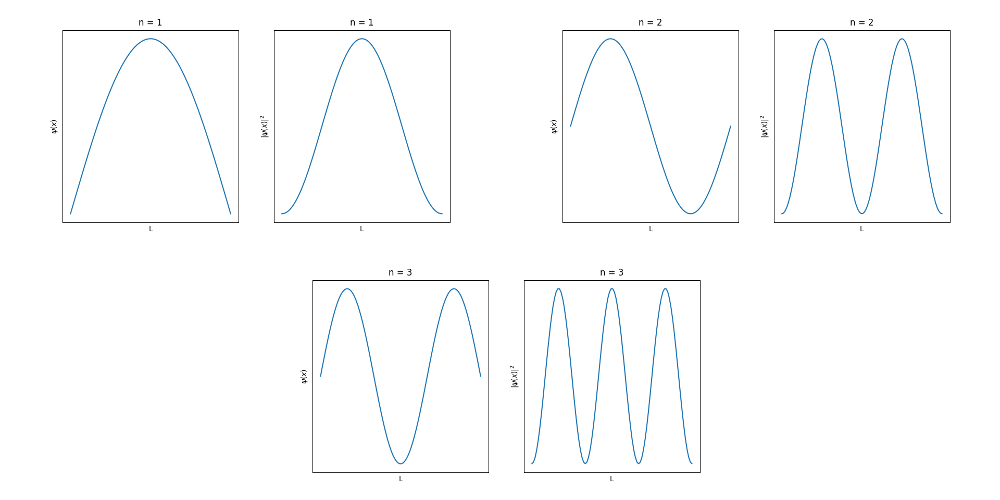
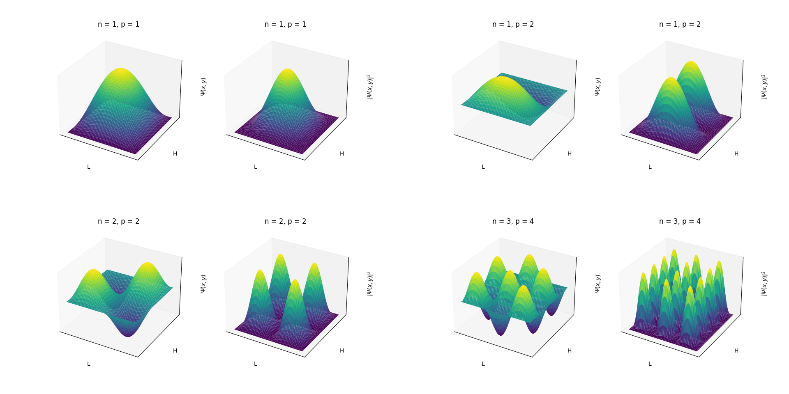
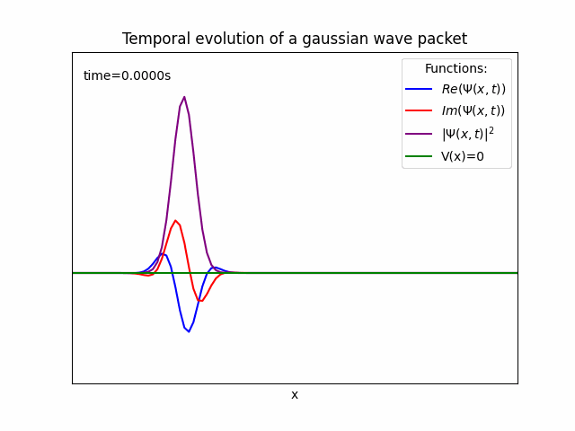
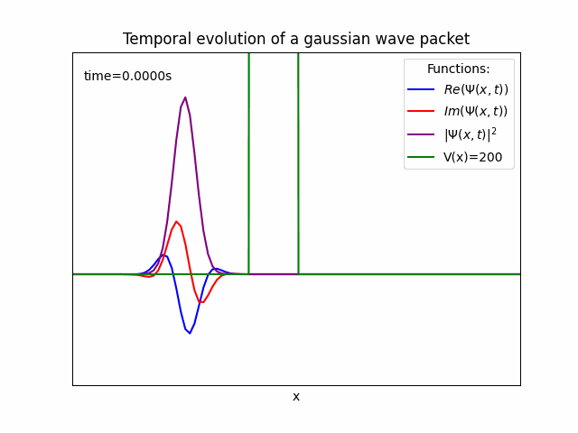
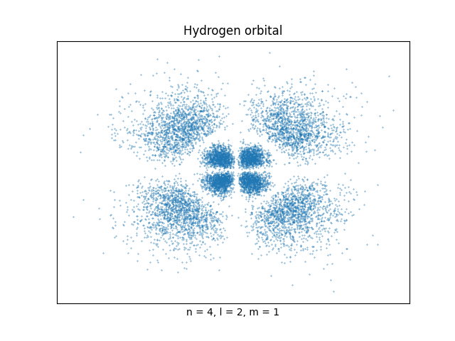
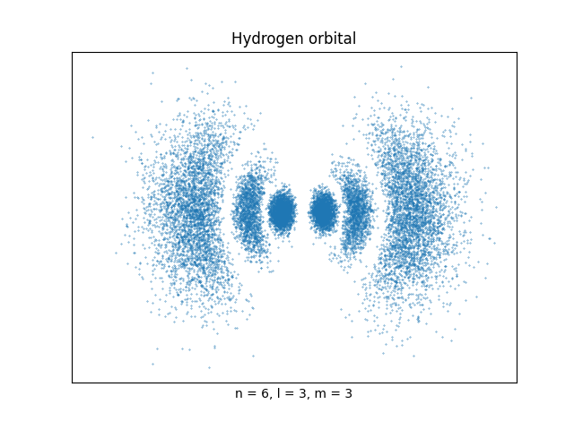
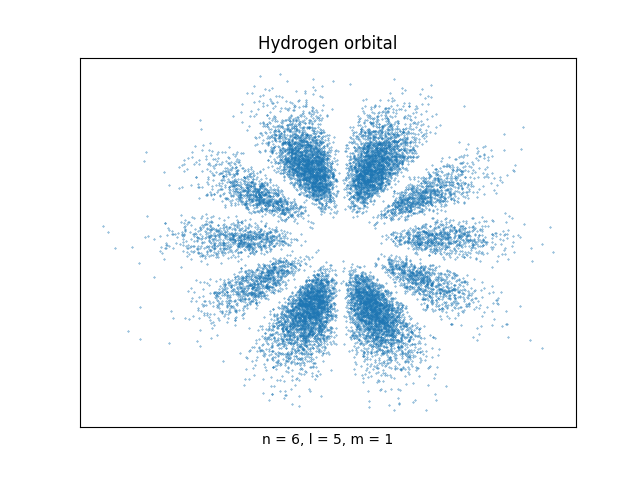

## quantumVis
Some scripts to work with quantum visualization.

## Table of Contents
- [Dependencies](#dependencies)
- [Particle in a box](#particle-in-a-box)
- [Time evolution of a gaussian wave packet](#time-evolution-of-a-gaussian-wave-packet)
- [Hydrogen orbitals](#hydrogen-orbitals)
- [License](#license)

## Dependencies

To work with this project your python interpreter must have [Matplotlib](https://matplotlib.org/)(v3.5.1) and [Numpy](https://numpy.org/)(v1.22.2) installed. If you don't have, just pip install them.
```
  pip install matplotlib
```
```
  pip install numpy
```


## Particle in a box

With [particle_in_a_box.py](particle_in_a_box.py) you can visualize the wave function and the probability distribution around the space of a particle confined in a box, just by setting some quantum numbers.

<p align="center">
  
  
</p>

## Time evolution of a gaussian wave packet

With [wave_packet.py](wave_packet.py) you can visualize time evolution of a wave packet.

<p align="center">
  
</p>


And you can also see a tunneling effect too. Only by setting some potential energy.

<p align="center">
  
</p>

## Hydrogen orbitals

Last and not least, with [atom_hydrogen.py](atom_hydrogen.py), you can plot hydrogen orbital setting the quantum numbers n, m, l. It take a while to compute all the points, because the algorithm use a monte-carlo method to find all the points (over 10k points). Below you can see some results. 

<p align="center">
  
  
  
  
</p>

Since the wave function of an electron of hydrogen can be found around all the space (-∞, ∞), you need to limit the space around some values where the wave function isn't too close to zero. This values are find using a function created by me. It works just for some low n, m, l values. Maybe you need to adjust if you want to test with some larger n, m, l quantum numbers.

## License

Distributed under the MIT License. See `LICENSE` for more information.

## Contact

Italo Albuquerque - [@Italoc_Alb](https://twitter.com/Italoc_Alb) - italoc.alb@gmail.com
