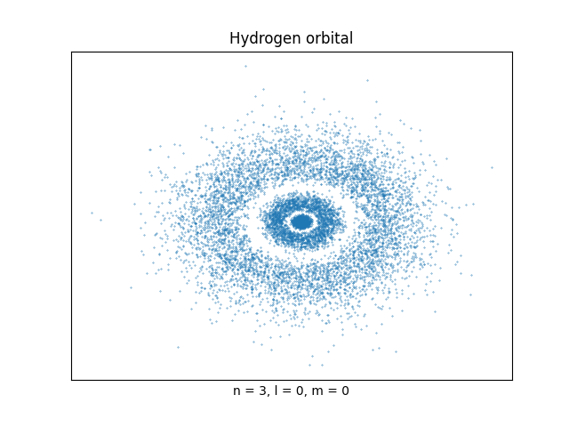
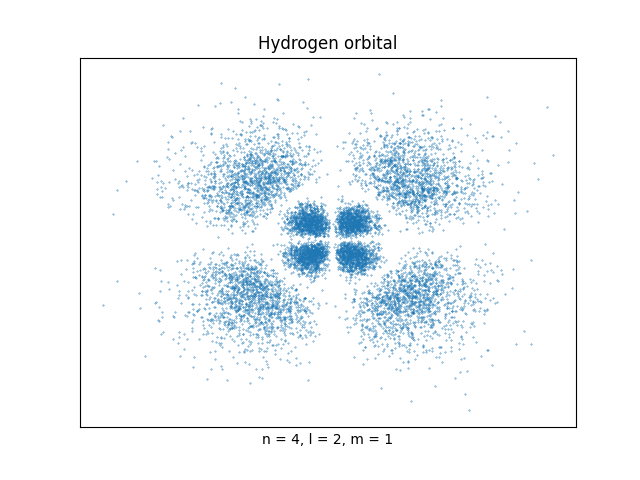
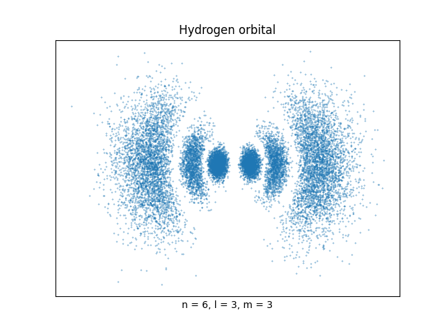
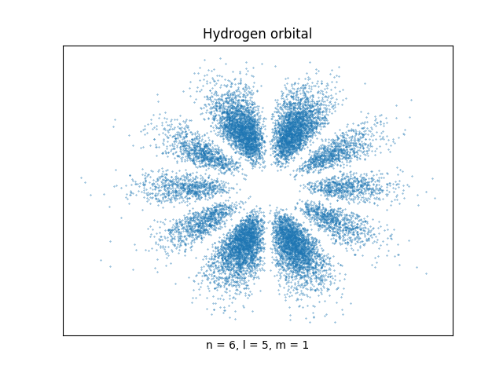

## quantumVis
Some scripts to work with quantum visualization.

## Summary
- [Particle in a box](#particle-in-a-box)
- [Time evolution of a gaussian wave packet](#time-evolution-of-a-gaussian-wave-packet)
- [Hydrogen orbitals](#hydrogen-orbitals)

## Particle in a box

With [particle_in_a_box.py](particle_in_a_box.py) you can visualize the wave function and the probability distribution around the space of a particle confined in a box, just by setting some quantum numbers.

## Time evolution of a gaussian wave packet

With wave_packet.py you can visualize time evolution of a wave packet.

And you can also see a tunneling effect too. Only by setting some potential energy.

## Hydrogen orbitals

Last and not least, with atom_hydrogen.py, you can plot hydrogen orbital setting the quantum numbers n, m, l. It take a while to compute all the points, because the algorithm use a monte-carlo method to find all the points (over 10k points). Below you can see some results. 

Since the wave function of an electron of hydrogen can be found around all the space (-∞, ∞), you need to limit the space around some values where the wave function isn't too close to zero. This values are find using a function created by me. It works just for some low n, m, l values. Maybe you need to adjust if you want to test with some larger n, m, l quantum numbers.
