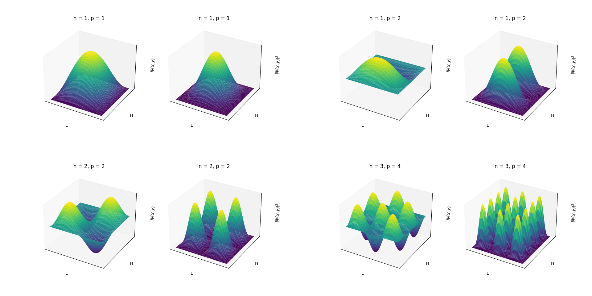
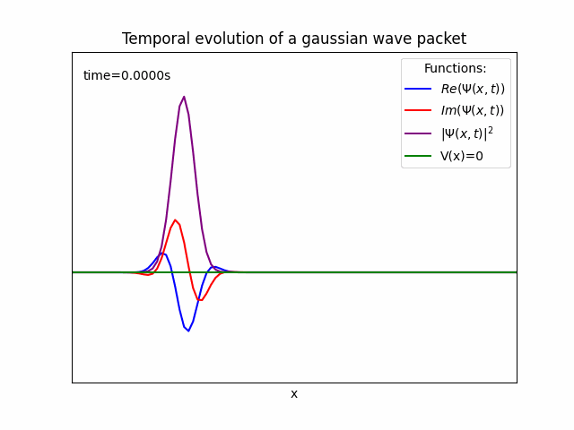
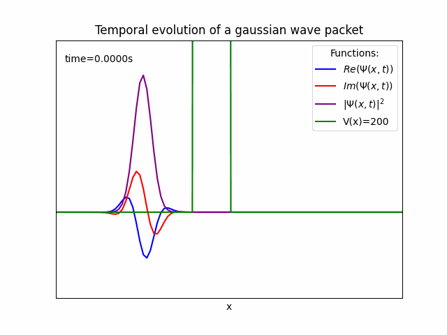

# quantumVis
Some scripts to work with quantum visualization.

With particle_in_a_box.py you can visualize the wave function and the probability distribution around the space of a particle confined in a box. Just by setting some quantum numbers.

With wave_packet.py you can visualize time evolution of a wave packet.

And you can also see a tunneling effect too. Only by setting some potential energy.

